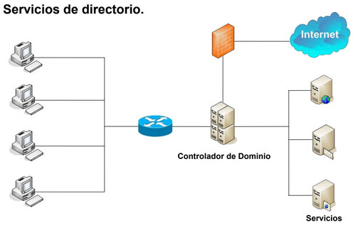

:::note[Connexió amb el currículum]
**6. Opera sistemes en xarxa gestionant els seus recursos i identificant les restriccions de seguretat existents.**	

a) S'ha configurat l'accés a recursos locals i recursos de xarxa.  
b) S'han identificat i configurat els drets d'usuari i directives de seguretat.  
c) S'han explotat servidors de fitxers, servidors d'impressió i servidors d'aplicacions.  
d) S'ha accedit als servidors utilitzant tècniques de connexió remota.  
e) S'ha avaluat la necessitat de protegir els recursos i el sistema.  
f) S'han instal·lat i avaluat utilitats de seguretat bàsica.  
g) S'han configurat i explotat dominis.  
:::

## Sistemes d'Organització de Xarxes

- En l'actualitat no es concep la idea de treballar de manera aïllada. Ben al contrari, cada vegada està més present la interconnexió entre ordinadors formant xarxes.
- Des de xarxes xicotetes domèstiques conegudes com a **PAN (Personal Area Network)**, xarxes de centres de treball **LAN (Local Area Network)** fins a les grans xarxes **WAN (Wide Area Network)** que permeten interconnectar xarxes entre si, com és Internet.
- Serà necessari un **Sistema Operatiu de Xarxa (SOR)** que gestione aquestes xarxes i els elements que les componen.
- Les seues tasques més importants seran:
  - Gestió centralitzada de recursos.
  - Oferir serveis als clients.
  - Proporcionar accés segur als recursos.
  - Monitorització del que està passant en la xarxa.

## 1. Xarxa entre iguals. Estructura de treball en grup.
- Una xarxa plana entre iguals és aquella en què cap equip realitza tasques d'administració, només de si mateix. Cada client és administrador dels recursos que ofereix a la xarxa i tots poden accedir.
- No existeix una administració centralitzada. Si cadascú comparteix el que vol quan vol sense que hi haja un control, la localització del recurs pot ser un problema greu.
- Microsoft va introduir en els seus sistemes operatius la possibilitat de crear grups de treball, que dividien la xarxa en subconjunts.

:::danger[Desavantatges]
- Molt fàcil de configurar i difícil de gestionar. No existeix un control sobre qui té accés i qui no als recursos.
- Poca funcionalitat.
- Recursos dispersos en la xarxa.
- Molt insegura (usuaris "avançats").
:::

## 2. Estructura Client-Servidor. Servidors Independents.
- Xarxa no plana (existeixen servidors dedicats).
- És un model d'aplicació distribuïda, les tasques es divideixen entre els proveïdors de recursos i serveis.
- Un client realitza una petició a un servidor i aquest li respon.
- Facilita l'administració i la localització de recursos.

:::danger[Desavantatges]
- Cada servidor manté la seua pròpia llista d'usuaris i recursos.
- Si un client necessita accedir a múltiples servidors, requerirà múltiples comptes i contrasenyes.
- La sincronització entre servidors pot ser un problema.
:::

## 3. Serveis de Directori i Dominis
- Un **servei de directori** és un conjunt d'aplicacions que guarden i administren la informació sobre els elements d'una xarxa.
- Un servei de directori ofereix una infraestructura per localitzar, administrar i organitzar els components i recursos d'una xarxa.
- Elements clau:
  - **Directori:** Repositori únic per a informació d'usuaris i recursos.
  - **Domini:** Conjunt d'objectes dins del directori.
  - **Controlador de Domini:** Servidor que autentica i administra accessos.
  - **Catàleg Global:** Base de dades amb la informació de tots els objectes de la xarxa.

