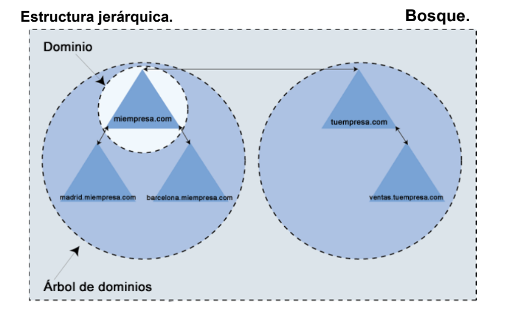

## Dominis

Conjunt d'objectes que comparteixen una àrea i una nomenclatura específica.

Ens permet:
- Delimitar la seguretat `(usuaris, accés, recursos…)`.
- Replicar la informació `(unitats de còpies de seguretat)`.
- Aplicació de Polítiques de Grup `(influeixen al domini)`.
- Delegar permisos administratius `(entre dominis o objectes del domini)`.
- Organitzat en Arbres i Boscos `(estructura jeràrquica)`.
- Establir relacions de confiança `(entre dominis)`.

### Arbre
Conjunt de dominis dependents d'una arrel comuna i que tenen una estructura jeràrquica. Aquesta jerarquia es caracteritza per tenir un espai de noms comú (un servidor DNS propi). L'objectiu d'aquesta fragmentació de l'estructura és replicar només les parts necessàries per disminuir el trànsit a la xarxa.

  - D'aquesta manera sabem que **miEmpresa.net**, **damA.miEmpresa.net** i **damB.miEmpresa.net** formen part del mateix arbre, mentre que _miEmpresa.com_ i _miEmpresa.es_ no.
  - Si un usuari és creat dins d'un domini, automàticament serà reconegut en tots els dominis que jeràrquicament depenguen del domini al qual pertany.

### Bosc
És el major contenidor lògic dins del directori, contenint tots els dominis dins del seu àmbit. Cadascun d'aquests contenidors posseeix el seu propi espai de noms i una forma de relacionar-se amb la resta de boscos. Els dominis estan interconnectats per relacions de confiança, de manera que els dominis dins d'un bosc confien automàticament uns en altres i els diferents arbres podran compartir recursos (es veurà més endavant).
Diversos arbres poden integrar-se en el mateix bosc, però NO compartiran espai de noms (DNS).
Un bosc contindrà almenys un domini, que serà el domini arrel del bosc.

En aquest exemple es veu com s'han unit **5 dominis** en un bosc. D'aquests 5 dominis 3 pertanyen a un arbre (arrel: **miempresa.com**) i els altres 2 a un segon arbre (arrel: **tuempresa.com**).
Les _fletxes_ que veiem en l'esquema són les relacions de confiança entre dominis. Totes han estat creades automàticament per Windows Server. Tots els dominis poden comunicar-se entre si gràcies a les propietats de les relacions de confiança.

### Relacions de confiança
Mètode de comunicació segura entre dominis, arbres i boscos, que permeten als usuaris autenticar-se en una altra part del directori a la qual no pertanyen.

### GPO o Polítiques de Grup (Group Policy Object)
Són un conjunt de configuracions específiques per a usuaris i equips d'un domini, que s'emmagatzemen en objectes de directrius de grup. Quan una GPO s'aplica en un controlador de domini, tots els objectes d'aquest domini han de complir aquesta regla. L'ús és senzill i centralitzat, n'hi haurà prou amb habilitar/deshabilitar l'opció en el gestor de GPO.

  - Els requisits per utilitzar una GPO són dos, que la xarxa estiga basada en una estructura de domini i que existisca almenys un controlador de domini i que els equips i usuaris han d'estar units al domini, utilitzant credencials de domini per iniciar sessió en els seus equips. És a dir, que siguen objectes del directori.

### Nomenclatura
- Ordinadors: 
  - computer_name.domain_name
    - PC01.miempresa.net
- Usuaris:
  - user_name@domain_name
    - user_name@miempresa.net
  - DOMAIN_NAME\user_name (NetBios style) # old style
    - MIEMPRESA\user_name
  

:::note[Resum]
Un servei de directori ofereix tota la informació dels recursos de la xarxa a través d'una única ubicació. Per a això converteix cada recurs en un objecte i emmagatzema la seva informació en una base de dades jeràrquica i opcionalment distribuïda. La gestió d'aquestes dades es realitza a través d'un protocol determinat per la versió del servei de directori escollit. En el nostre cas **ACTIVE DIRECTORY**
:::

:::danger
- Una vegada instal·lat AD no es pot canviar el nom de la màquina
- La IP del servidor ha de ser fixa
:::